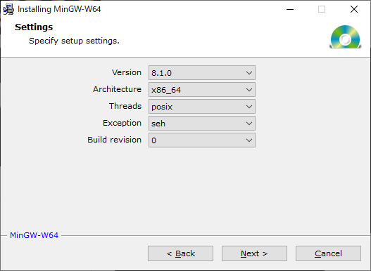
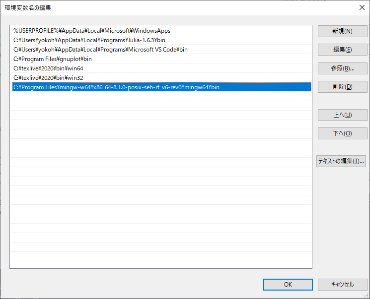
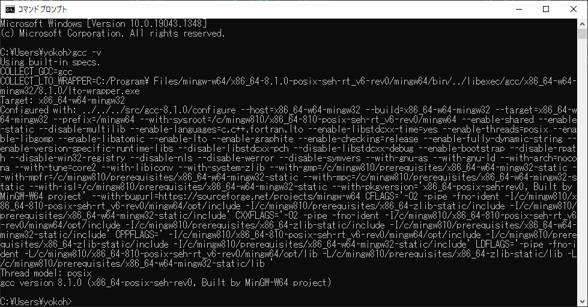
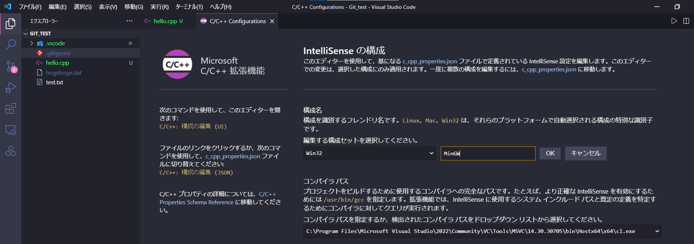
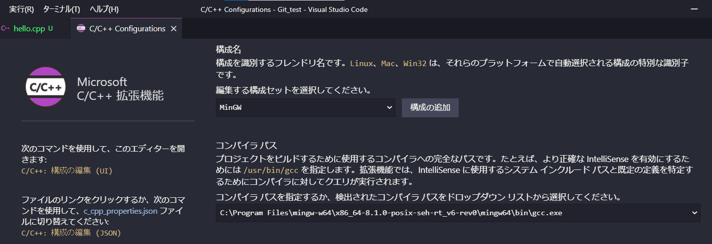
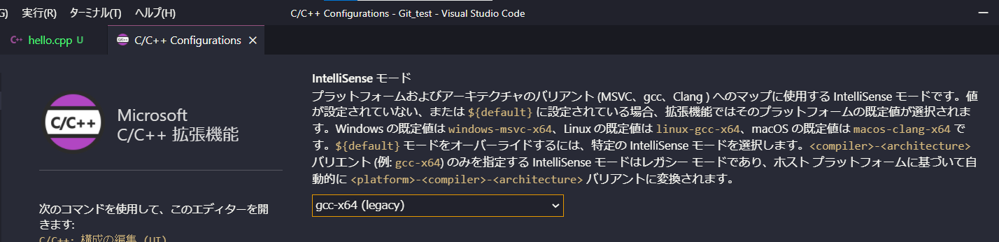
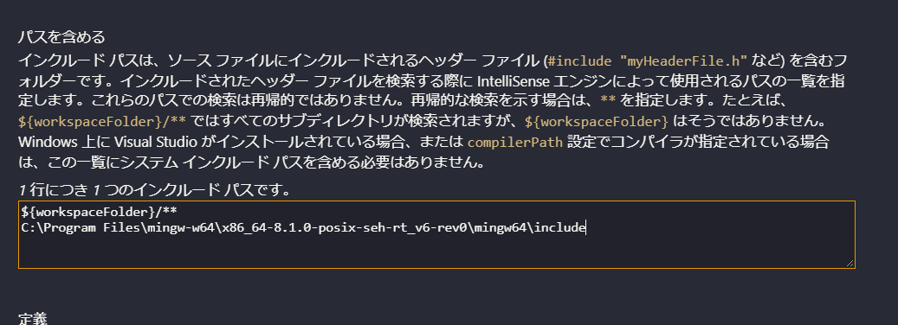
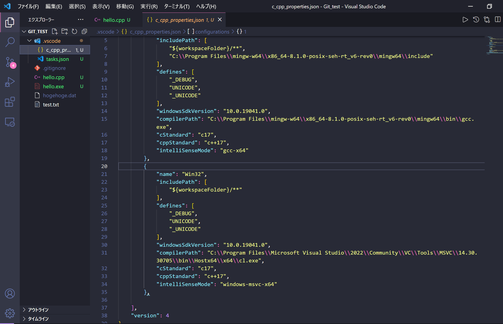
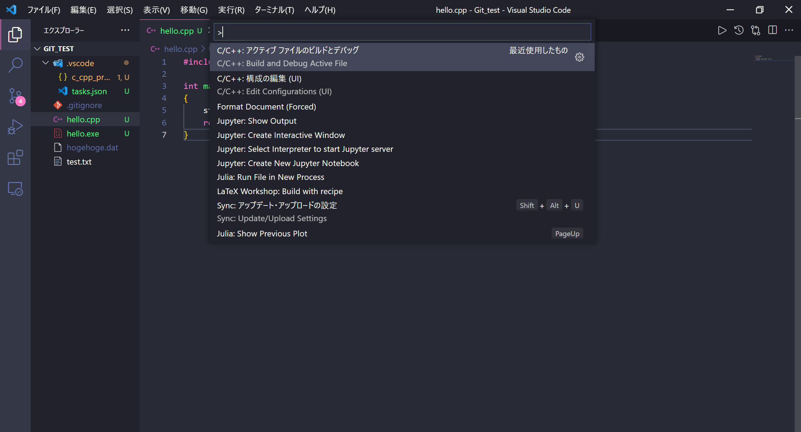
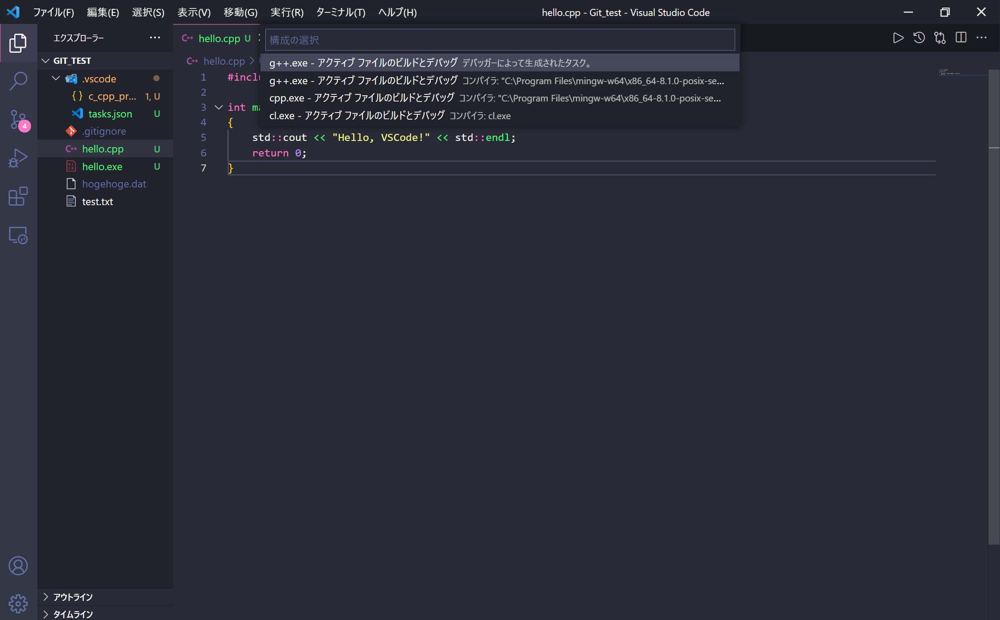

# C++をVSCodeで動かせるようにする.

## C++コンパイラのインストール
ここではWindowsに限り説明する. MacOSやLinuxの場合に関しても単にターミナルでc++/g++が実行できる環境が整っていれば事前準備完了である. すでにここが整っている場合は次へ進む.

MinGW64を入れるために[ダウンロードサイト](https://sourceforge.net/projects/mingw-w64/files/mingw-w64/mingw-w64-release/)からMinGW-W64-install.exeをダウンロードして実行. 以下のような画面がでてくるので64bit版Windowsを使っている場合はArchitectureをx86_64に変更.

## Pathを通す
PathにMinGW64のbinを追加.

## 環境が構築できているか確認
任意のディレクトリにでターミナルを開いて`gcc -v`と入力し, 最後にバージョンが表示されれば完成.

## C/C++ extension for VS Codeのインストール
VSCodeの拡張機能に[C/C++ extension for VS Code](https://marketplace.visualstudio.com/items?itemName=ms-vscode.cpptools)を追加する.

`Ctrl+Shift+P`を押して, C/C++構成の編集を探してクリック. すると下記のような画面に以降するので, 下記画像のように各種Pathを書き込んでいく.

Windowsは「msvc-x64/msvc-x86」Linuxは「gcc-x64/gcc-x86」Macは「clang-x64/clang-x86」になります.

これで環境設定が完了する. 一度再起動してC++を動かしたいディレクトリを見ると.vscodeフォルダが作成され, そこにコンパイルプロセスが記載されているはず.

そして適当にテストコードを書いて`Ctrl+Shift+P`でC/C++: アクティブファイルのビルドとデバッグを選択し, 使いたいビルド方式を選択.(とりあえずg++.exeを選べば良い.)
すると実行がなされ, ターミナルにその結果が出力される.

注意として.vscodeフォルダが無いと実行ができなくなるので, もし別のディレクトリに移動する場合にはこのフォルダをコピペするか, もう一度同じ作業をする必要がある.  (これに関してはsetting.jsonに記載することでGlobalに使えるようにしようと現在試みている最中である.)

