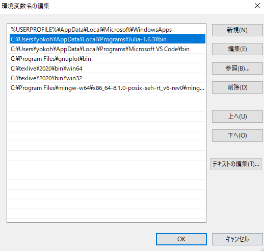
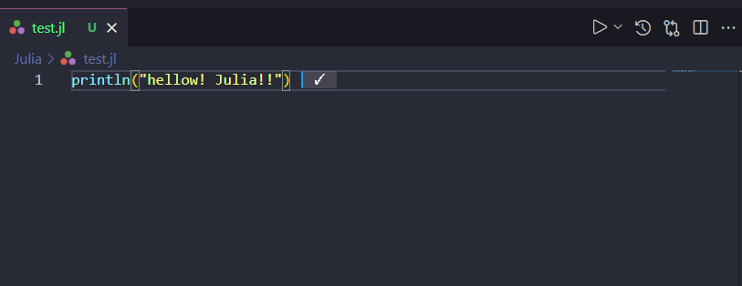

# VSCodeでJuliaを動かせるようにする

## Juliaのインストール
[公式サイト](https://julialang.org/downloads/)からver.1.6.3をダウンロード. ダウンロード先は`C:\Users\<ユーザー名>\AppData\Local\Julia-1.6.3\`.

## Pathに追加
環境変数編集において, Pathをクリック->編集->新規に`C:\Users\<ユーザー名>\AppData\Local\Julia-1.6.3\bin`を追加.



## 初期設定
コマンドプロンプトで`Julia`と入力し, Juliaの起動が可能であることを確認.

## VSCodeにおいてpathを通す
VSCodeにおいて[Julia拡張機能](https://marketplace.visualstudio.com/items?itemName=julialang.language-julia)をダウンロードする.

`ctrl+,`をして右上のボタンをおして

`setting.json`開き, 下記文言を記入.
```
    "terminal.integrated.commandsToSkipShell": [
        "language-julia.interrupt"
    ],
    "julia.symbolCacheDownload": true,
    "julia.enableTelemetry": true,
    "julia.executablePath": "C:\\Users\\<USERNAME>\\AppData\\Local\\Programs\\Julia-1.6.3\\bin\\julia.exe",
    "julia.environmentPath": "\\C:\\Users\\<USERNAME>\\AppData\\Local\\Programs\\Julia-1.6.3\\",
    "terminal.integrated.commandsToSkipShell":[
        "language-julia.interrupt"
    ]
}
```

これでテストとしてJuliaファイルを.jlで以下のように作成し, `Shift+Enter`で実行がなされれば成功.(初回の実行には少し時間がかかるので注意.)

