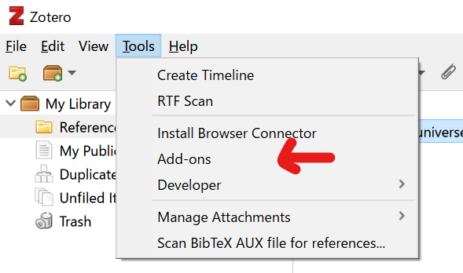
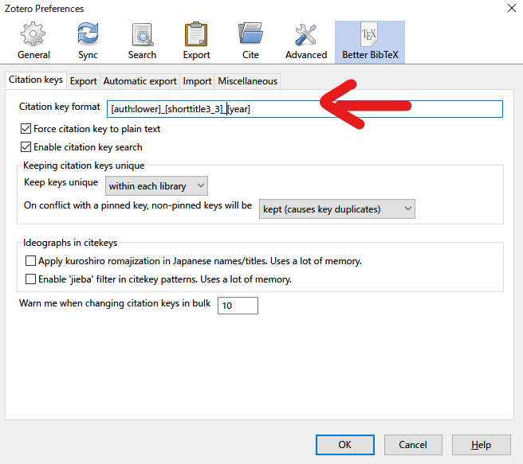
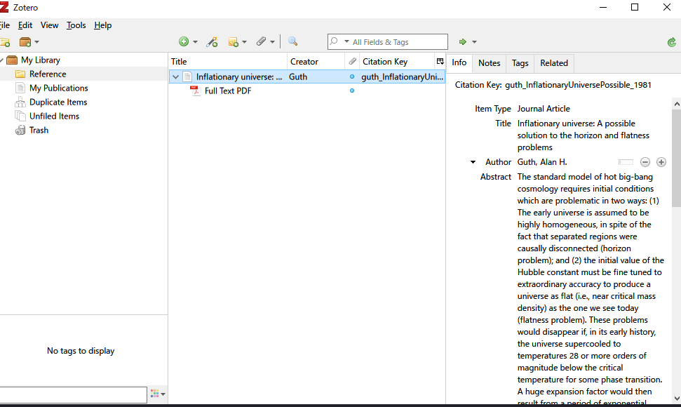
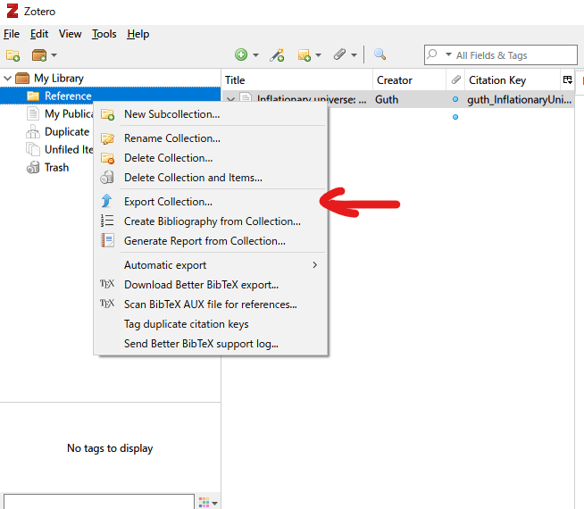
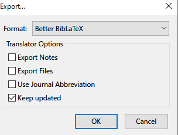
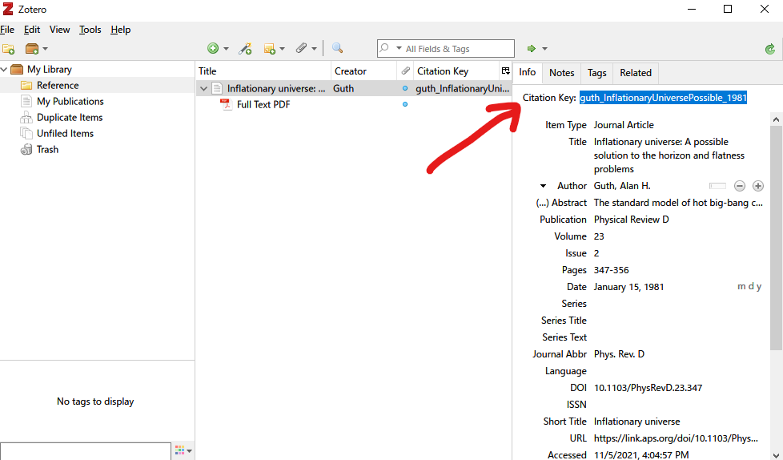

# Zotero
論文の管理にめちゃめちゃ便利. webページから自動的にタイトル, 著者, abst, pdf, etc. を読み込んでくれて, bibファイルへの書き出しもユーザーで自由にそのスタイル変えられて便利. Zotero上で文献を更新すると, bibファイルも自動で更新してくれる優れもの!

## Zoteroのインストール
[Zotero公式サイト](https://www.zotero.org/)においてchrome版と共にインストール.

## Zoteroに拡張機能を追加
ZoteroにLatex bibitexのための拡張機能(better bibtex)を導入するために(これがあるとcitationのときに便利)[ここ](https://retorque.re/zotero-better-bibtex/installation/)の右上のlatest releaseをクリックして.xpiファイルを保存.
!

Zoteroの```Tools -> Add-ons```をクリックして.xpiファイルをドラッグ. その後再起動を繰り返してアドインがZoteroに入る.


## better bibitexの設定
Zoteroの```Edit -> Preferences```をクリックしてここで設定を色々変更できる. とりあえず, 書き出しの際に邪魔になるabstract, file, dolをエクスポートしないように設定した.


自動でcitationを作成してくれるがその名前を好みの形に設定.



Web上で保存をするときにSnapshotはいらないので(デフォルトでは入る), 設定で保存する対象を決定. (現在はBibtexとPDFを設定.)


## 文献の取り込み
### Chromeの拡張機能によるやり方
Zoteroに蓄えたい論文のページに行って右上の拡張機能ボタンを押す.

そうすると自動的にPDFやその他もろもろの情報がZotero上に保存される!


### Bibtexファイルによる取り込み
各雑誌サイトにおいてbibtex形式にcitationを書き出す. Zoteroにおいて```File -> Import```をクリックして保存したbibtexファイルを取り込む. 


## 書き出し
論文を溜め込んだら, 書き出したいフォルダを右クリックしてExport Collectionをクリック.

そしてFormatをBetter BibLaTexに変更して書き出しの際の各種オプションを選択. ここで, ```keep updated```にチェックを入れておくとZotero上のフォルダ内で変更があったときに, 自動で書き出したbibファイルを更新してくれる!



## TeXでのcitation
各論文のcitationの名前は論文の名前をクリックして右のinfoにおいて```Citation Key```にあるので, 引用の際にbibファイルを再度開く必要はない!



参考: [Zotero+BibTeXで参考文献の出力を自動化&論文の引用で出てきた順にソートする](https://qiita.com/skrb_hs/items/73061b7a8e39f1e73e0d)
