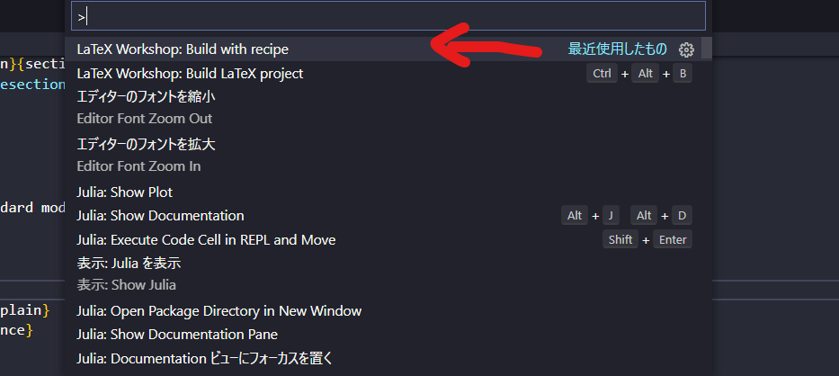

 # VsCodeのLaTeXにおいてBibTeXを実行し, pTeXの実行まで行う.
めちゃめちゃ雑にメモを残します.

 Setting.jsonに下記のように記載する. なお, `command: "hoge"`において私はフルパスで記載しているが, おそらく一般的にはその必要は無い. (例: `"command": "latexmk"`と記載すれば良い.)


 ```
{"latex-workshop.latex.tools": [
    {
        "command": "C:\\texlive\\2017\\bin\\win32\\latexmk",
        "args": [
            "-synctex=1",
            "-interaction=nonstopmode",
            "-file-line-error",
            "-pdf",
            "%DOC%"
        ],
        "name": "latexmk"
    },
    {
        "command": "C:\\texlive\\2017\\bin\\win32\\pdflatex",
        "args": [
            "-synctex=1",
            "-interaction=nonstopmode",
            "-file-line-error",
            "%DOC%"
        ],
        "name": "pdflatex",
        },
        {
            "command": "C:\\texlive\\2017\\bin\\win32\\bibtex",
            "args": [
                "%DOCFILE%"
            ],
            "name": "bibtex",
        },
        {
            "command": "C:\\texlive\\2017\\bin\\win32\\ptex2pdf",
            "args": [
                "-interaction=nonstopmode",
                "-l",
                "-ot",
                "-kanji=utf8 -synctex=1",
                "%DOC%.tex"
            ],
            "name":"ptex2pdf",
        },
       {
            "command": "C:\\texlive\\2017\\bin\\win32\\ptex2pdf",
            "args": [
                "-l",
                "-u",
                "-ot",
                "-kanji=utf8 -synctex=1",
                "%DOC%"
            ],
            "name":"ptex2pdf (uplatex)",
        },
        {
            "command": "C:\\texlive\\2017\\bin\\win32\\pbibtex",
            "args": [
                "-kanji=utf8",
                "%DOCFILE%"
            ],
            "name": "pbibtex",
        }
],
"latex-workshop.latex.recipes": [
{
    "name": "ptex2pdf",
    "tools": [
        "ptex2pdf"
    ]
},
{
    "name": "latexmk",
    "tools": [ 
        "latexmk"
    ]
},
{
    "name": "pdflatex",
    "tools": [
        "pdflatex"
    ]
},
{
    "name": "pdflatex -> bibtex -> pdflatex*2",
    "tools": [
        "pdflatex",
        "bibtex",
        "pdflatex",
        "pdflatex"
    ]
},
{
    "name": "ptex2pdf -> pbibtex -> ptex2pdf*2",
    "tools": [
        "ptex2pdf",
        "pbibtex",
        "ptex2pdf",
        "ptex2pdf"
    ]
},
{
    "name": "ptex2pdf (uplatex)",
    "tools": [
        "ptex2pdf (uplatex)"
    ]
},
{
    "name": "ptex2pdf (uplatex) -> pbibtex -> ptex2pdf (uplatex) *2",
    "tools": [
        "ptex2pdf (uplatex)",
        "pbibtex",
        "ptex2pdf (uplatex)",
        "ptex2pdf (uplatex)"
    ]
},
],


"latex-workshop.latexindent.path": "C:\\texlive\\2017\\bin\\win32\\latexindent.exe",
"latex-workshop.view.pdf.viewer": "tab",
"editor.renderControlCharacters": true,

"[tex]": {
    // スニペット補完中にも補完を使えるようにする
    "editor.suggest.snippetsPreventQuickSuggestions": false,
    // インデント幅を2にする
    "editor.tabSize": 2
},

"[latex]": {
    // スニペット補完中にも補完を使えるようにする
    "editor.suggest.snippetsPreventQuickSuggestions": false,
    // インデント幅を2にする
    "editor.tabSize": 2
},

"[bibtex]": {
    // インデント幅を2にする
    "editor.tabSize": 2
},
 ```

 以上のような記載をすると, `ctrl+S`の保存と同時にptexがコンパイルされ, pdfの出力まで行われるはずである. 超簡略化して説明すると, 
 ```
    "latex-workshop.latex.tools": []
 ```
 の部分がコンパイルの際にする作業を記載しており, その実行コマンドの名前が`name: hoge`で特徴づけされている. そして`ctrl+S`で実行されるような自動化を行っているのが. 
```
    "latex-workshop.latex.recipes": []
```
の部分であると思っていただければ良い. いまデフォルトで`ctrl+S`でptexがコンパイルされ, pdfの出力まで行われるのは`"latex-workshop.latex.recipes"`の一番始めに書いているのがptexの実行であるからそうなっている.

| レシピ | 内容 |
| ---- | ---- |
| latexmk | LaTeXmkを用いてコンパイル |
| pdflatex | pdfLaTeXを用いてコンパイル |
| pdflatex -> bibtex -> pdflatex*2 | pdfLaTeXとBibTeXを用いてコンパイル |
| ptex2pdf | ptex2pdfを用いてコンパイル |
| ptex2pdf -> pbibtex -> ptex2pdf*2 | pLaTeXとpBibTeXを用いてコンパイル |
| ptex2pdf (uplatex) | upLaTeXを用いてコンパイル |
| ptex2pdf (uplatex) -> pbibtex -> ptex2pdf (uplatex) *2 | upLaTeXとpBibTeXを用いてコンパイル |

これを踏まえて, もしbibtexを`ctrl+S`で実行したければ一番始めにbibtexをもってくればそうなる.(伝われ.)

しかし個人的には毎回pdfLaTeXとBibTeXを用いてコンパイルするのは非効率だと思うので, デフォルトはpdfLaTeXで良いかと思う. 

## BibTeXのコンパイルとLaTeXの実行
実際にbibファイルを作ってbibtexをコンパイルしたい場合のやり方を説明する. コンパイルを行いたいファイルにおいて`ctrl+shift+P`を押す. そうするとコマンドパレットが開くので, build with recipeを選択. 


そして先の表を参考に実行したいコンパイルを選ぶ. 今のbibtexを動かすという目的においては, 日本語の場合は`ptex2pdf -> pbibtex -> ptex2pdf*2`を, 英語の場合は`pdflatex -> bibtex -> pdflatex*2`を選択すれば, pLaTeX -> pBibTeX -> pLaTeX -> pLaTeXというように実行がなされる.


参考: [Visual Studio CodeでTeXのコンパイルをできるようにする方法](https://qiita.com/SUZUKI_Masaya/items/7fb5509006163e7e671f)

